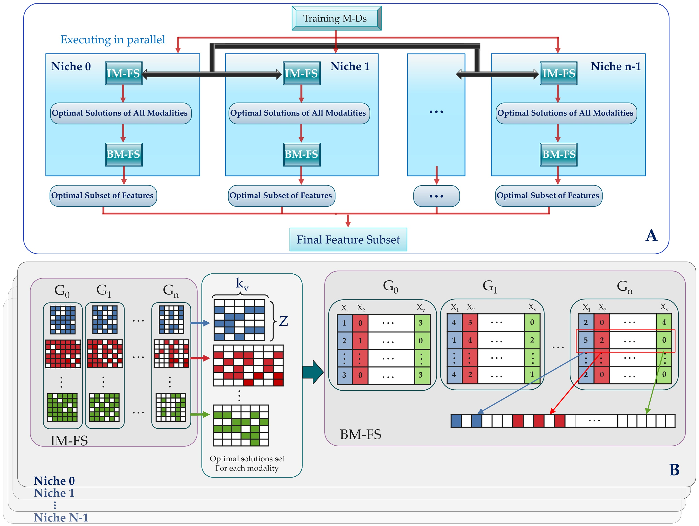

 
# MMFS-GA

### Multi-view feature selection based on multi-chromosome architectures

--------
**Maintainer**: Vandad Imani, vandadim@uef.fi

**License**: MIT License 

## Table of content
- [1. Introduction](#id-section1)
- [2. Implementations](#id-section2) 

## 1. Introduction

[Multi-view datasets](Multimodal%20Dataset/) contain multiple forms of data and are beneficial for prediction models. However, using such data can lead to high-dimensional challenges and poor generalization. Selecting relevant features from multi-view datasets is important for addressing these issues and improving interpretability. Traditional feature selection methods have limitations, including failure to leverage information from multiple modalities and lack of generalizability. They are often tailored to specific tasks and lack interpretability. To overcome these limitations, a novel approach called the multi-view multi-objective feature selection genetic algorithm (MMFS-GA) is proposed. It simultaneously selects optimal feature subsets within and between modalities, demonstrating superior performance and interpretability for multi-view datasets. Evaluation results on benchmark datasets show improvement over baseline methods. This work provides a promising solution for multi-view feature selection and encourages further research in this area.

## 2. Implementations

To facilitate the implementation of our proposed approach, we provide this repository that includes the necessary code and resources. Before running the code, please make sure to install the required [DEAP](https://github.com/DEAP/deap) package by following this [link](https://pypi.org/project/deap/).

The [runMMFS_GA](https://github.com/vandadim/MMFS-GA/blob/main/mmfs-GA/runMMFS_GA.py) script is designed to optimize a Multimodal Feature Selection (MMFS) problem using the genetic algorithm. The script executes the ivfs function from the [mmfs2GA](https://github.com/vandadim/MMFS-GA/blob/main/mmfs-GA/mmfs2GA.py) module, leveraging parallel processing with multiple processes. It takes a set of input parameters and input files as its inputs.

### Input

- ***inputfile (list):*** The data set provided as a list of tuples, where each tuple represents one view of the data.
- ***outputdir (str):*** The path to the output directory where the results of MMFSGA will be saved.
- ***REAL_A (ndarray, optional):*** An optional true feature matrix for input file A. If not provided, it defaults to None.
- ***REAL_B (ndarray, optional):*** An optional true feature matrix for input file B. If not provided, it defaults to None.
outputdir (str): 
 
### Output

The [runMMFS_GA](https://github.com/vandadim/MMFS-GA/blob/main/mmfs-GA/runMMFS_GA.py) script produces a set of selected features that can be utilized in the [result_acc](https://github.com/vandadim/MMFS-GA/blob/main/mmfs-GA/results_acc.py) function to evaluate a classification model. The evaluation includes generating a ROC plot, calculating the Area Under the Curve (AUC), Balanced Accuracy, Recall, Specificity, and Sensitivity.

--------
**References**: If you are using MMFS-GA for the Multimodal feature selection, please cite the following paper:

|       | Citation     | Paper Link
| -------------  | -------------  | -------------  |
| MMFS-GA    |  Imani, Vandad, Carlos Sevilla-Salcedo, Vittorio Fortino, and Jussi Tohka. "Multi-Objective Genetic Algorithm for Multi-View Feature Selection." arXiv preprint arXiv:2305.18352 (2023). |[Link](https://arxiv.org/pdf/2305.18352.pdf)| 
